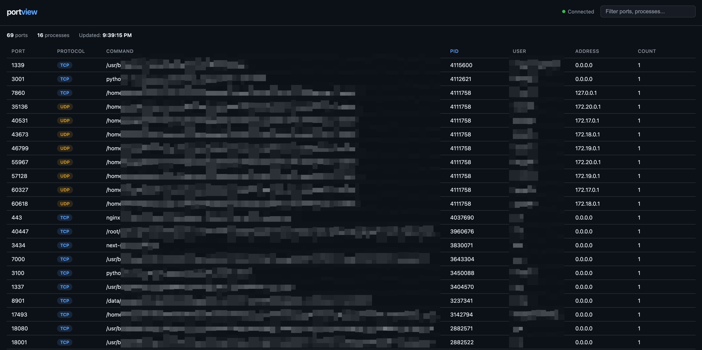

# portview

Lightweight, single-binary web-based port monitor. Real-time port → process → PID → user mappings in your browser.



## Install

```
curl -fsSL https://vcdim.github.io/portview/install.sh | bash
```

## Usage

```
sudo portview
```

Open http://localhost:9999. Use `-p` to change port, `-i` to change refresh interval:

```
sudo portview -p 8080 -i 5s
```

Or run as a systemd service:

```
sudo systemctl enable --now portview
```

## Uninstall

```
curl -fsSL https://vcdim.github.io/portview/uninstall.sh | sudo bash
```

## Build from Source

```
go build -o portview .
```

## License

MIT
