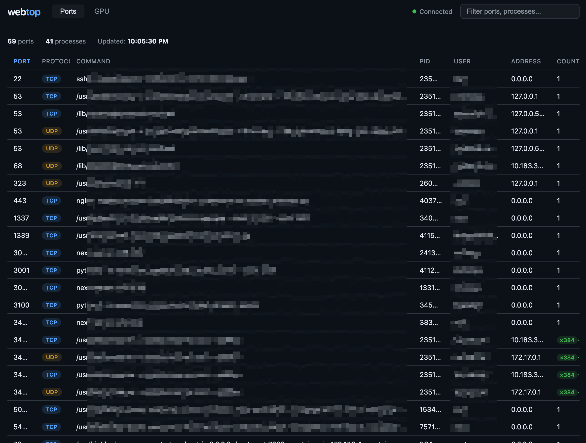
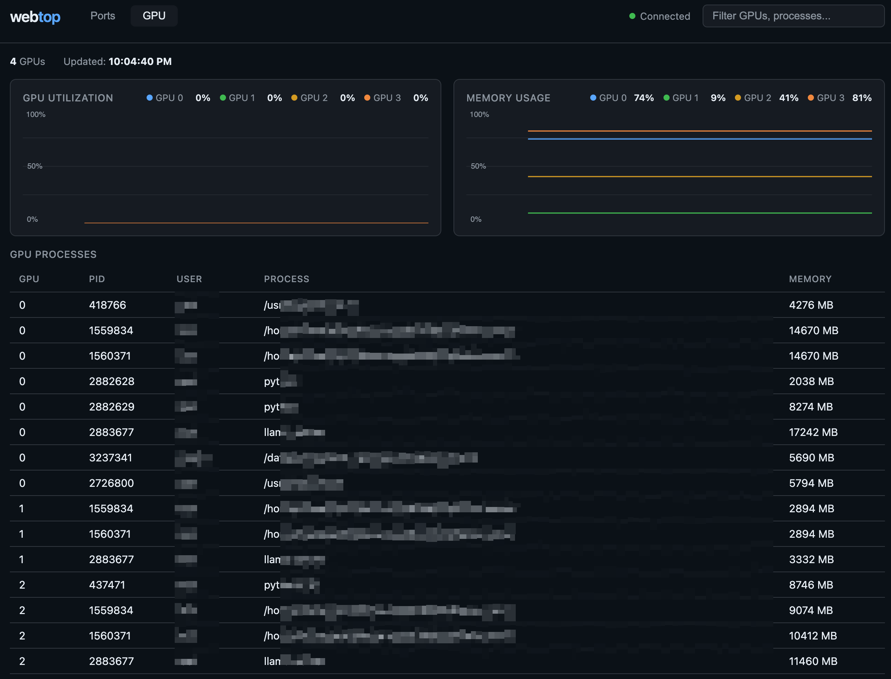

# webtop

Lightweight, single-binary web-based system dashboard. Real-time port monitoring and GPU status in your browser.




## Install

```
curl -fsSL https://vcdim.github.io/webtop/install.sh | bash
```

## Usage

```
sudo webtop
```

Open http://localhost:9999. Use `-p` to change port, `-i` to change refresh interval:

```
sudo webtop -p 8080 -i 5s
```

Or run as a systemd service:

```
sudo systemctl enable --now webtop
```

## Uninstall

```
curl -fsSL https://vcdim.github.io/webtop/uninstall.sh | sudo bash
```

## Build from Source

```
go build -o webtop .
```

## License

MIT
